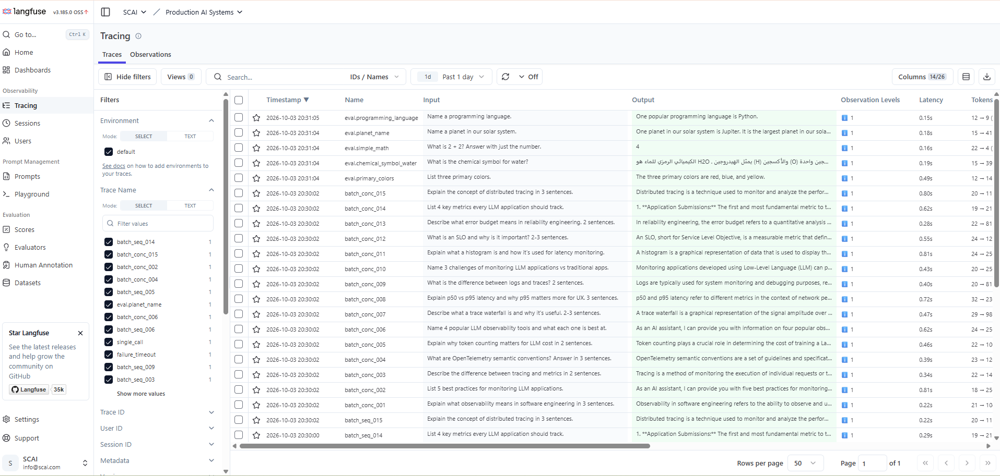
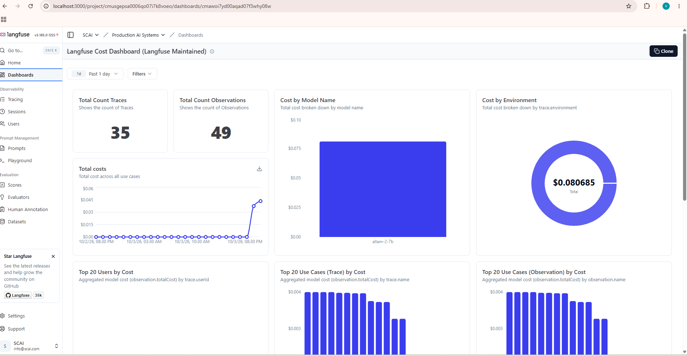
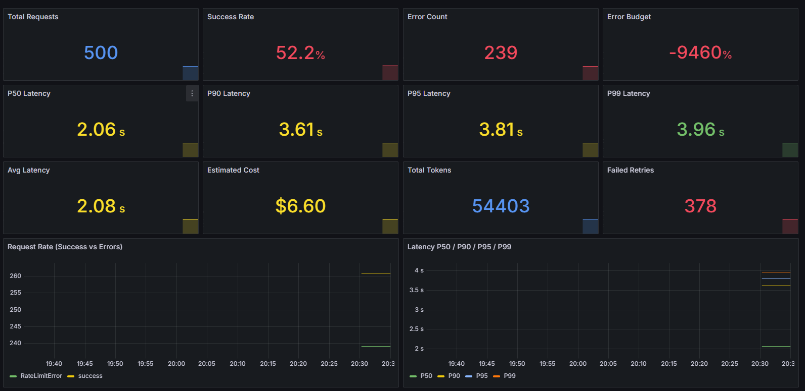

# llm-observability-lab

**Production-grade LLM observability lab** — one instrumented LLM application
watched simultaneously by **five** observability platforms.

GitHub: [avivek-dwivedi/llm-observability-lab](https://github.com/avivek-dwivedi/llm-observability-lab)

```
                    ┌───────────────────────────┐
                    │   Instrumented Python app │   ← Groq SDK LLM calls
                    │  (observability/ library) │
                    └─────────────┬─────────────┘
                                  │ OTLP (traces + metrics)
                    ┌─────────────▼─────────────┐
                    │     OTel Collector        │   ← single fan-out point
                    └───┬───────┬───────┬───────┼───────┐
                        ▼       ▼       ▼       ▼       │
                  Langfuse   Phoenix  LangSmith  Prometheus → Grafana
                 (traces)   (traces)  (SaaS)      (metrics → SLO dashboards)
```

> This is **not** a chatbot or serving product — no frontend, no API layer.
> The example scripts exist to generate *controlled, realistic* telemetry.
> Built by **Vivek Dwivedi** (**[@avivek-dwivedi](https://github.com/avivek-dwivedi)**)
> as a hands-on SRE-meets-LLM-engineering portfolio project.

## Why this project exists

After you ship an LLM feature, three questions keep Ops teams awake:

1. **What is it costing us?** — tokens × price, per trace, per user, per use case
2. **Is it fast/healthy?** — latency percentiles, error rate vs an explicit SLO
3. **When it breaks, what actually happened?** — full trace waterfalls

This lab answers all three by wiring **one** OpenTelemetry pipeline to the
platforms SRE teams already use, then *stress-testing the dashboards* with
deliberate failure scenarios (degraded model, rate-limit storms, timeouts).

## Observability surfaces

| Surface | Type | What you get |
|---|---|---|
| **Langfuse** (self-hosted) | Traces | Cost, tokens, latency, users, quality scores per trace |
| **Arize Phoenix** (self-hosted) | Traces | Trace waterfall with input/output JSON |
| **LangSmith** (SaaS) | Traces | Trace inspection + evaluation runs |
| **Prometheus + Grafana** | Metrics | SLOs, error budget, P50–P99, token/cost dashboards |
| **OTel Collector** | Raw | Single fan-out point for all of the above |

## Key engineering decisions

- **One OTel pipeline, five backends.** A single `TracerProvider` + single
  OTLP export keeps the app code trivial; the collector fans out to every
  backend independently (no per-backend SDKs in the app).
- **Clean manual GenAI spans instead of auto-instrumentation.** OpenInference's
  Groq auto-instrumentor serializes the whole SDK request object (including
  `groq.Omit` sentinels) into Langfuse. `completions_span()` emits minimal,
  readable `llm.input_messages` / `llm.output_messages` JSON instead.
- **Cost honesty in three tiers.** Provider-reported cost, configured
  estimate, and missing pricing are tracked separately — an estimate is
  never mislabeled as a bill.
- **Identity-aware traces.** Every script stamps `langfuse.user.id` /
  `langfuse.session.id`, so per-user cost and session grouping work out of
  the box in Langfuse.
- **Native evaluation scores.** `07_evaluation.py` runs 5 deterministic
  cases through 4 heuristic checks (success, relevance, completeness,
  conciseness) and posts them as **native Langfuse Score objects** via the
  public API — not just span attributes — so the Scores dashboards populate.
- **Scenario-driven verification.** `06_synthetic_metrics.py` replays 1,500
  offline observations across Normal / LLM-Degraded / System-Failure
  profiles, driving the three Grafana dashboards — including error-budget
  exhaustion — without touching the real API.
- **Evidence, not vibes.** [`Evidence/`](Evidence/README.md) stores
  screenshots from the live run of every dashboard these scripts produce.

## What it does

### V1 — Tracing (Langfuse + Phoenix + LangSmith)

- One **OpenTelemetry TracerProvider** + **one** OTLP exporter → a local
  **OpenTelemetry Collector**.
- The collector fans the same trace out independently to the three trace
  backends above.
- Captures standard **GenAI** semantic-convention attributes plus supported
  **OpenInference** attributes.
- A `completions_span()` context manager emits clean LLM input/output
  attributes (no SDK request objects leaked into telemetry).
- Manual spans only for workflow/retry info the auto-instrumentation does
  not capture.
- Computes **estimated cost** from token counts + a configurable per-million
  price; provider-reported cost, configured estimate and missing pricing are
  three separate tiers (an estimate is never mislabeled as a bill).

### V2 — Metrics + SLOs (Prometheus + Grafana)

- **Metrics pipeline**: Python OTLP metrics → Collector → Prometheus → Grafana.
- **Counters**: completed requests, LLM tokens (input/output), estimated
  cost, API attempts.
- **Histogram**: end-to-end logical-request latency with a 4-second bucket
  boundary.
- **Two internal SLOs**: 7-day success ≥ 99.5% and ≥ 95% of requests under 4 s,
  with error-budget tracking and an insufficient-data state.
- **Three Grafana dashboards**: service overview, token/cost analytics,
  failure/SLO diagnostics — plus three scenario dashboards (Normal,
  LLM Degraded, System Failure) for demo replays.

## Example scripts — every one generates real evidence

| Script | Traces | Live API? | What it proves |
|---|---|---|---|
| `01_single_call.py` | 1 | yes | Basic trace with clean input/output, tokens, cost |
| `02_multiple_calls.py` | 1 | yes | Nested pipeline (retrieve → generate → evaluate) with child spans |
| `03_concurrent_calls.py` | 50 | yes (~1 min) | Concurrency-safe tracing, user/session attribution |
| `04_failures.py` | 3 | **no** | ERROR traces (timeout, rate limit, transient) + retry spans |
| `05_batch_dashboard.py` | 30 | yes | Batch cost/latency distributions for dashboards |
| `06_synthetic_metrics.py` | 0 | **no** | Drives all 3 Grafana dashboards offline (Normal / Degraded / Failure) |
| `07_evaluation.py` | 5 | yes | 4 native quality scores per trace in Langfuse's Scores dashboards |

## Verified results

All dashboards below were generated by this repo's scripts and captured live
(see [`Evidence/`](Evidence/README.md) for all 14 screenshots):

| Dashboard (Grafana, scenario) | Requests | Success | Errors | Error budget | P50 → P99 | Est. cost |
|---|---|---|---|---|---|---|
| 1. Normal | 500 | 98.8% | 6 | −140% | 327 ms → 497 ms | $12.51 |
| 2. LLM Degraded | 500 | 92.2% | 39 | −1460% | 3.61 s → 7.91 s | $11.41 |
| 3. System Failure | 500 | 52.2% | 239 | −9460% | 2.06 s → 3.96 s | $6.60 |

On the Langfuse side: 50 parallel traces with clean prompt/response text,
P95 end-to-end latency ~0.9–1.2 s, per-trace cost percentiles, and native
evaluation scores.

### Dashboard highlights

**Langfuse — Tracing:** every trace shows clean prompt/response text (no SDK
objects), tokens, cost and latency:



**Langfuse — Cost dashboard:** per-trace and per-observation cost, model
usage split, all priced via the Model Definition API:



**Grafana — scenario dashboards:** the same metrics pipeline replayed under
Normal / LLM-Degraded / System-Failure profiles:



## Repository layout

```
llm-observability-lab/
├── observability/                # the reusable instrumentation library
│   ├── instrumentation.py        # TracerProvider, workflow + completions spans
│   ├── metrics.py                 # counters + histogram + flush
│   ├── slos.py                    # SLO evaluation + error budget
│   ├── usage.py                   # provider-reported usage extraction
│   ├── pricing.py                 # estimated cost (3 tiers)
│   └── metadata.py                # GenAI + OpenInference attribute builder
├── examples/                      # telemetry-generating scripts (table above)
├── infrastructure/
│   ├── otel-collector.yaml        # traces + metrics pipelines
│   ├── prometheus.yml             # scrape config
│   ├── prometheus-rules.yml       # SLO recording + alerting rules
│   ├── setup_langfuse_model.py    # registers/updates Langfuse pricing
│   ├── sync-keys.ps1              # .env → collector.env auth header
│   ├── import_dashboards.py       # imports scenario Grafana dashboards
│   └── grafana/                   # dashboards + provisioning + datasources
├── notebooks/                     # 2 Jupyter notebooks (practical + theory)
├── docs/                          # per-backend guides + SLO definitions
├── tests/                         # pytest suite
├── Evidence/                      # screenshots from the live verified run
├── docker-compose.yml             # Phoenix + Prometheus + Grafana + Collector
├── RUNBOOK.md                     # exact from-zero setup + full-wipe recovery
└── .env.example
```

## Quick start

Prereqs: **Docker**, **Python ≥ 3.11**, a Groq API key, and optionally a
LangSmith API key. Langfuse keys come from your own self-hosted Langfuse
(step 2 below).

```bash
# 1. install
pip install -e ".[dev]"

# 2. start Langfuse (self-hosted, from its own repo)
git clone https://github.com/langfuse/langfuse.git
cd langfuse && docker compose up -d   # UI on http://localhost:3000
# then sign up, create a project, and copy the API keys

# 3. configure
cp .env.example .env
#    fill in GROQ_API_KEY, LANGFUSE_PUBLIC_KEY, LANGFUSE_SECRET_KEY,
#    optionally LANGSMITH_API_KEY. Set ALLOW_LIVE_CALLS=1 for real calls.

cd ..   # back to the repo root

# 4. sync collector secrets + start this stack
./infrastructure/sync-keys.ps1         # PowerShell on Windows
docker compose up -d                   # Phoenix, Prometheus, Grafana, Collector

# 5. register Langfuse model pricing (cost dashboard shows USD)
python infrastructure/setup_langfuse_model.py

# 6. generate telemetry
python examples/01_single_call.py       # first trace
python examples/06_synthetic_metrics.py # offline: fills the Grafana dashboards

# 7. test
pytest
```

Full exact steps (including `docker compose down -v` full-wipe recovery)
live in [RUNBOOK.md](RUNBOOK.md). Per-backend deep-dives live in [docs/](docs/):
[Langfuse](docs/LANGFUSE.md) · [Phoenix](docs/PHOENIX.md) ·
[LangSmith](docs/LANGSMITH.md) · [Grafana](docs/GRAFANA.md) ·
[SLOs](docs/SLOS.md) · [Dashboards](docs/DASHBOARDS.md). Notebook walkthroughs:
[practical](notebooks/01_practical_walkthrough.ipynb) ·
[theory](notebooks/02_theory_explanation.ipynb).

## Scope guardrails (by design)

This project deliberately does **not** include:

- prompt management, agents, RAG tooling, or productized LLM evaluation
- application-level routing or quota enforcement
- a frontend, chat UI, FastAPI service, or authentication layer
- a production rate limiter

Where a backend lacks a native dashboard view, the lab **states the
limitation** instead of building a replacement UI.

## Safety

- Prompt text and API keys are never recorded as span attributes. The
  collector additionally strips known sensitive keys.
- `04_failures.py` uses a **deterministic fake provider** — it never calls
  the real Groq API and cannot exhaust quota.
- Live Groq calls are gated behind `ALLOW_LIVE_CALLS=1`; `06_synthetic_metrics.py`
  is fully offline.

## Testing

```bash
pytest                 # full suite
pytest tests/test_slos.py -v   # just the SLO engine
```

Covers SLO math (success/latency/error-budget states), metric recording,
pricing tiers, usage extraction, span attribute building, and failure
classification.

## License

MIT — see [pyproject.toml](pyproject.toml).